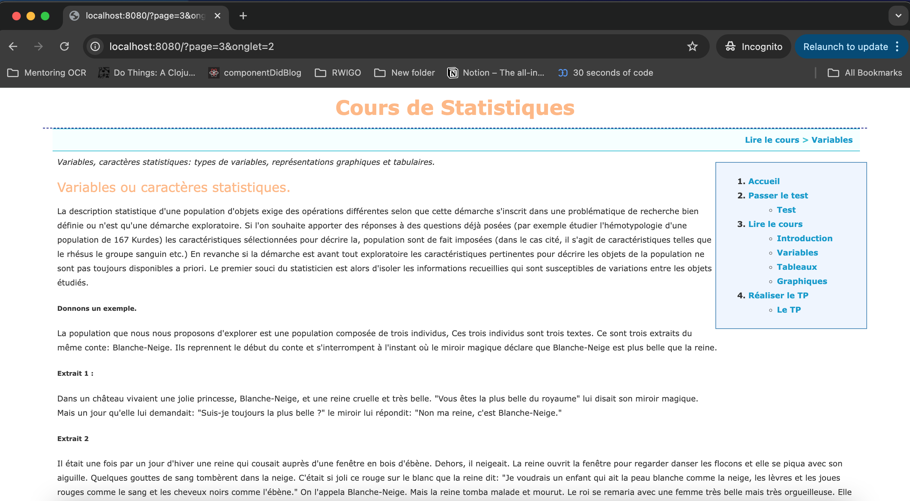

# TP2 Chloé

## Objectifs
Rendre dynamique un site en PHP
- Récupérer du contenu existant et le séparer sur différentes pages
- Mettre en place un système de Routing permettant de naviguer entre pages & onglets
- Adapter le design grâce à différents thèmes
- Créer un fil d'ariane dynamique & clickable

## Contraintes
- Réaliser le projet sans ajouts de dépendances externes

## Requis
PHP >= 8.2

## Démarrage
```
php -S localhost:8080 -t .
```
## Rendu



## Explications
- style.css: Feuille de style. Mettre en forme + couleur + espacements...
- index.php: Point d'entrée de l'application
- Page00 - Page06 — Invisible, chargé *dynamiquement*
- Moteur — Prend la décision du contenu à afficher (quelle page on affiche en fonction de l'URL) 
- Menu - Affiche des différentes parties qui permettent de rediriger l'utilisateur
- Chemin — Fil d'ariane qui permet de savoir ou on est